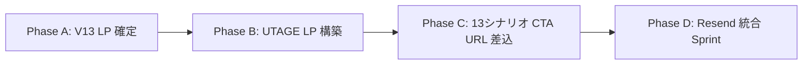

# UTAGE × LINE Harness × Resend 統合アーキテクチャ

> **Status**: Active (鬼洗練 v3 Round 1+2 完了、子竜全面承認 2026-05-09)
> **正本性**: このドキュメントは IGNITION ファネル統合の **唯一の正本** である。
> **関連 ADR**: [ADR-0001](decisions/0001-line-token-exclusive.md) / [ADR-0002](decisions/0002-email-engine-resend-exclusive.md)
> **Provenance**: proposals `25e69188-6753-4427-966a-e2f7f1771b9e` + `9873c089-1645-4f3e-a55a-a6c679dce67a`

---

## 全体構造

```
[UTAGE Surface]
   └─ LP V13 / event-form / form-payment のみ。message_* (LINE/Email配信) 全て不使用
        ↓ Webhook (一方向)
[LINE Harness Person SSOT]
   └─ friends + scenarios.steps.channel + scoring + 13シナリオ
        ↓ LINE                               ↓ Email
   [LINE Messaging API]                 [Resend]
                                         (React Email + Cloudflare Workers + Webhook→scoring)
```

すべての「人」は `friends` テーブルに集約され、配信チャネル (`line` / `email` / `both`) は `scenarios.steps.channel` で抽象化される。UTAGE は **Surface 層** のみを担い、配信エンジンには関与しない。

---

## 8原則

### Round 1 — LINE Harness as SSOT, UTAGE as Surface
proposal `25e69188`、構造美 5→9、δ型 (鬼洗練 v3)

1. **LINE Messaging API トークンは LINE Harness 専有** — quota 競合を構造的に防止
2. **UTAGE は LINE 配信機能を使わない** — `message_*` 系全て不使用
3. **UTAGE は Surface のみ** — LP / 予約 / 決済のみ
4. **Webhook は一方向** — UTAGE → LINE Harness のみ。逆方向は許可しない
5. **LINE Harness が SSOT** — 「人」の真実は LINE Harness 側に存在する

### Round 2 — Person SSOT + Channel Abstraction + Resend Engine
proposal `9873c089`、構造美 9→10、δ型 (鬼洗練 v3)

6. **Person = 1 SSOT** — `friends.email` カラム追加で「人」を統一管理 (LINE/Email を超越)
7. **Channel は抽象化** — `scenarios.steps.channel` で `line` / `email` / `both` を切替可能
8. **Email 配信は Resend 専有** — Cloudflare Workers + React Email + Webhook→scoring

---

## 実装範囲 (LINE Harness 側)

| 範囲 | 内容 |
|---|---|
| D1 schema | `friends.email` / `scenarios.steps.channel` / `scenarios.steps.email_template_id` 追加 |
| 配信サービス | `apps/worker/src/services/email-delivery.ts` 新設 (Resend SDK) |
| Webhook 受信 | `apps/worker/src/routes/webhooks/utage.ts` 新設 (UTAGE→LH) |
| Webhook 受信 | `apps/worker/src/routes/webhooks/resend.ts` 新設 (open/click/bounce → scoring) |
| メールテンプレ | `apps/worker/src/templates/emails/` 新設 (React Email、V12 LP デザイン継承) |
| Scoring | `channel_source` 列挙型に `ignition_lp` 追加 (初期スコア +40) |

---

## 実装フェーズ (子竜承認済)



| Phase | 主成果物 | 依存 |
|---|---|---|
| **A** | V13 LP 確定 (②文言 / CTA文言 / 受講生実証言) | なし |
| **B** | UTAGE LP V13 構築 (event-form / form-payment URL確定) | A |
| **C** | 13シナリオ CTA URL 差込 (D1 update) | B |
| **D** | Resend 統合 Sprint (D1+SDK+React Email+Webhook+ADR確定) | C |

GitHub 上の実装計画は **Milestone: IGNITION Funnel Integration** および **Epic Issue** を参照。

---

## なぜこの設計か (子竜の世界観における必然性)

V12 LP 構造美 10 + 13シナリオ proposal `0922e6a7` 構造美 9 の両方を保護しつつ、UTAGE のノーコード LP / 決済機能を取り込み、Resend で配信レピュテーションを最大化する。

- **コード SSOT**: 全コードを git 管理 (`Decision-as-Code`)
- **AI ネイティブ**: `friends` + `scoring` を SSOT に集約することで AI による予測・分岐が単一視点で実行可能
- **単一インフラ**: Cloudflare Workers に統一。Vercel / Railway 等を増やさない

UTAGE と LINE Messaging API トークンの **quota 競合** という単純な技術的制約から出発し、「人」と「チャネル」の混同を許さない構造へ昇華した結果、配信レピュテーション・Single Source of Truth・AI 予測適合性のすべてを同時に最大化できた。

---

## 適用ガイドライン

- **新機能・新シナリオ実装時**: この 8 原則に違反しないか先に確認すること
- **UTAGE で「メール配信」「LINE 配信」機能を使いたくなったら**: 拒否し、Resend / LINE Harness に倒す
- **「人」と「チャネル」を混同した設計**: SSOT 分裂を生むため許可しない。人 = `friends`、チャネル = `channel` フィールド
- **Webhook を双方向にしたくなったら**: 一方向制約 (#4) を読み返すこと

---

## Teaching Cases (整合性確認済)

| Provenance | 内容 | 適用 |
|---|---|---|
| `c2070223` | Session Boundary Authority Consolidation | SSOT 集約原則 |
| `fa5cd2ab` | Context-Signal Architecture | データ統一保存 + context 重み付け |
| `5f80bb4f` | Read-Before-Write Loop | Webhook 一方向性 |
| `c7df819a` | session-quickstart 廃止 | wrong layer 最適化回避 |
| `0922e6a7` | 13シナリオ 5原則設計憲法 | 鬼洗練成果保護 |

---

## 外部参照

- Notion Checkpoint: <https://www.notion.so/35b2619c6bd38112b976f11bccf1874f>
- Supabase proposals: `25e69188-6753-4427-966a-e2f7f1771b9e` / `9873c089-1645-4f3e-a55a-a6c679dce67a`
- Supabase session_summaries: `80975dcd-d90e-476c-81e9-56ba2e7d7e37`

---

## 変更履歴

| 日付 | 変更 | Provenance |
|---|---|---|
| 2026-05-09 | 初版確立 (Round 1+2 鬼洗練 v3 完了、子竜全面承認) | proposals `25e69188` + `9873c089` |
